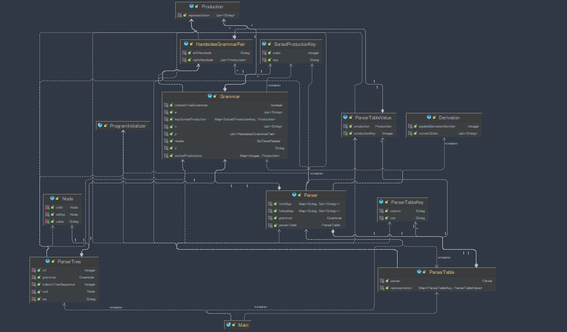

# ll_1-parser
link to github : https://github.com/Betterslash/ll_1-parser

Statement: Implement a parser algorithm

1. One of the following parsing methods will be chosen (assigned by teaching staff):
    1.b. ll(1)

2. The representation of the parsing tree (output) will be (decided by the team):
   2.b. derivations string (max grade = 9)

UML Diagram :

Implementation :
1. Grammar
      1. Class is parsed from file and mapped in the following structures :
      2. List<String> N;
      3. List<String> E;
      4. String S;
      5. List<HandsidesGrammarPair> P;
      6. * Grammar is also checked to be context free
      7. ** HnadsideGrammarPair class is represented as key value pair for string to a Production list 
      8. *** A Production is a wrapper class for a list of string values
      9. **** Sorted productions and key Sorted production are helper wrappers for enabling production numerotation for parser table as in seminar
    
2. Parser
      1.  Being a ll(1) parser it has 2 tables, one for follow and the second one for first
    represented as maps of string keys with set of string as values
      2.  After generating the first/follow tables, the parser is able to determine a sequence of derivations as numbers
    for a given sequence to be parsed
      3.  Also contains wrapper methods for toString making possible a smooth visualization of the parser process

3. Parser Table
   1. Class that has a parser as main initialization resource 
   2. Initializes with respect to its parser object
   3. The representation is Key-Value one with Keys of type ParserTableKey and Values of type ParserTableValue
   4. * ParserTableKey has a row and a colum string values
   5. ** Parser table value is represented by a production and its associated key
   6. This class has toString wrapper to be able to smoothly display its format

4. Parser tree
    Still in work at the presentation time

Test cases : 
#
    Grammar :
        N = { S, A, B, C, D }
        E = { +, *, (, ), a }
        S = S
        P = {
        S -> B A,
        A -> + B A | ϵ,
        B -> D C,
        C -> * D C | ϵ,
        D -> ( S ) | a
        }
    Sequence :
        a + ( a + a ) * ( a + a ) + a
    Results :
        First :
        A -> [ϵ, +]
        B -> [a, (]
        S -> [a, (]
        C -> [ϵ, *]
        D -> [a, (]
        
        Follow :
        A -> [$, )]
        B -> [$, ), +]
        S -> [$, )]
        C -> [$, ), +]
        D -> [$, ), *, +]
        
        Row = B Column = ( -> D C 4
        Row = A Column = + -> + B A 2
        Row = C Column = ) -> ϵ 6
        Row = + Column = + -> pop -1
        Row = A Column = ) -> ϵ 3
        Row = ) Column = ) -> pop -1
        Row = D Column = ( -> ( S ) 7
        Row = C Column = + -> ϵ 6
        Row = ( Column = ( -> pop -1
        Row = D Column = a -> a 8
        Row = a Column = a -> pop -1
        Row = C Column = * -> * D C 5
        Row = S Column = ( -> B A 1
        Row = S Column = a -> B A 1
        Row = $ Column = $ -> acc -1
        Row = B Column = a -> D C 4
        Row = * Column = * -> pop -1
        
        Derivations :
        [B, A] after applying (1)
        [D, C, A] after applying (4)
        [a, C, A] after applying (8)
        [a, A] after applying (6)
        [a, +, B, A] after applying (2)
        [a, +, D, C, A] after applying (4)
        [a, +, (, S, ), C, A] after applying (7)
        [a, +, (, B, A, ), C, A] after applying (1)
        [a, +, (, D, C, A, ), C, A] after applying (4)
        [a, +, (, a, C, A, ), C, A] after applying (8)
        [a, +, (, a, A, ), C, A] after applying (6)
        [a, +, (, a, +, B, A, ), C, A] after applying (2)
        [a, +, (, a, +, D, C, A, ), C, A] after applying (4)
        [a, +, (, a, +, a, C, A, ), C, A] after applying (8)
        [a, +, (, a, +, a, A, ), C, A] after applying (6)
        [a, +, (, a, +, a, ), C, A] after applying (3)
        [a, +, (, a, +, a, ), *, D, C, A] after applying (5)
        [a, +, (, a, +, a, ), *, (, S, ), C, A] after applying (7)
        [a, +, (, a, +, a, ), *, (, B, A, ), C, A] after applying (1)
        [a, +, (, a, +, a, ), *, (, D, C, A, ), C, A] after applying (4)
        [a, +, (, a, +, a, ), *, (, a, C, A, ), C, A] after applying (8)
        [a, +, (, a, +, a, ), *, (, a, A, ), C, A] after applying (6)
        [a, +, (, a, +, a, ), *, (, a, +, B, A, ), C, A] after applying (2)
        [a, +, (, a, +, a, ), *, (, a, +, D, C, A, ), C, A] after applying (4)
        [a, +, (, a, +, a, ), *, (, a, +, a, C, A, ), C, A] after applying (8)
        [a, +, (, a, +, a, ), *, (, a, +, a, A, ), C, A] after applying (6)
        [a, +, (, a, +, a, ), *, (, a, +, a, ), C, A] after applying (3)
        [a, +, (, a, +, a, ), *, (, a, +, a, ), A] after applying (6)
        [a, +, (, a, +, a, ), *, (, a, +, a, ), +, B, A] after applying (2)
        [a, +, (, a, +, a, ), *, (, a, +, a, ), +, D, C, A] after applying (4)
        [a, +, (, a, +, a, ), *, (, a, +, a, ), +, a, C, A] after applying (8)
        [a, +, (, a, +, a, ), *, (, a, +, a, ), +, a, A] after applying (6)
        [a, +, (, a, +, a, ), *, (, a, +, a, ), +, a] after applying (3) 
        
# 
    Grammar : 
    N = { program, decllist, arithmetic, arithmetic1, arithmetic2, multiply1, multiply2, term, term', declaration, lidentifier, type1, type2, type3, arraydecl, cmpdstmt, stmtlist, stmt, simplstmt, assignstmt, expression, factor, iostmt, structstmt, ifstmt, whilestmt, condition, returnstmt, forstmt, relation }
    E = { var, const, identifier, ϵ, id, ?, ;, :, {, }, [, ], ::, <-, +, -, ^, *, (, ), <, <=, >=, =, !=, >, for, while, mod, div, /, array, if, else, bool, typedef, ,, return, char, int, double, write, writeln, read, readln, nr }
    S = program
    P = {
    program -> var decllist ; cmpdstmt,
    cmpdstmt -> { stmtlist } | ϵ,
    decllist -> declaration ; decllist | cmpdstmt | ϵ,
    declaration -> id : type3 | arraydecl,
    type1 -> bool | char | int | double,
    type2 -> typedef :: identifier { decllist },
    type3 -> type1 | type2,
    arraydecl -> array [ nr ] :: type3,
    stmtlist -> stmt ; stmtlist | ϵ,
    stmt -> simplstmt | structstmt,
    simplstmt -> assignstmt | iostmt,
    assignstmt -> id <- expression ,
    expression -> arithmetic2 arithmetic1,
    arithmetic1 -> + arithmetic2 arithmetic1 | - arithmetic2 arithmetic1 | ϵ,
    arithmetic2 -> multiply2 multiply1,
    multiply1 -> * multiply2 multiply1 | / multiply2 multiply1 | ϵ,
    multiply2 -> ( expression ) | id | const,
    factor -> ( expression ) | identifier,
    iostmt -> read ( identifier ) | write ( identifier ) | readln ( identifier ) | writeln ( identifier ),
    structstmt -> { stmtlist } | ifstmt | whilestmt,
    ifstmt -> if ( condition ) cmpdstmt else cmpdstmt,
    whilestmt -> while ( condition ) cmpdstmt,
    condition -> + aritmethic | - aritmethic | / aritmethic | * aritmethic | div aritmethic | mod aritmethic | ^ aritmethic | ( expression ) term' relation expression | identifier term' relation expression,
    arithmetic -> expression term relation expression,
    returnstmt -> return expression ;,
    forstmt -> for ( assignstmt ; condition ; expression ) cmpdstmt,
    relation -> < | <= | = | != | >= | >,
    term' -> * factor term' | ^ factor term' | ϵ,
    term -> factor term'
    }
    
    Sequence : 
        var id : int ;
    
    Results : 
    First : 
        arithmetic1 -> [ϵ, +, -]
        arithmetic -> [const, (, id]
        program -> [var]
        arithmetic2 -> [const, (, id]
        relation -> [<=, <, !=, =, >, >=]
        multiply1 -> [ϵ, *, /]
        iostmt -> [read, writeln, write, readln]
        multiply2 -> [const, (, id]
        cmpdstmt -> [ϵ, {]
        decllist -> [array, ϵ, id, {]
        assignstmt -> [id]
        structstmt -> [{, while, if]
        term -> [identifier, (]
        arraydecl -> [array]
        factor -> [identifier, (]
        type3 -> [bool, double, char, typedef, int]
        type2 -> [typedef]
        expression -> [const, (, id]
        ifstmt -> [if]
        stmtlist -> [read, ϵ, writeln, id, {, while, write, readln, if]
        term' -> [ϵ, *, ^]
        type1 -> [bool, double, char, int]
        declaration -> [array, id]
        whilestmt -> [while]
        condition -> [div, identifier, mod, (, *, +, -, ^, /]
        forstmt -> [for]
        returnstmt -> [return]
        simplstmt -> [read, writeln, id, write, readln]
        stmt -> [read, writeln, id, {, while, write, readln, if]
        
        Follow :
        arithmetic1 -> []
        arithmetic -> []
        program -> [$]
        arithmetic2 -> [+, -]
        relation -> [const, (, id]
        multiply1 -> [+, -]
        lidentifier -> []
        iostmt -> [;]
        multiply2 -> [*, +, -, /]
        decllist -> [;, }]
        cmpdstmt -> [$, else, ;, }]
        assignstmt -> [;]
        term -> [<=, <, !=, =, >, >=]
        structstmt -> [;]
        arraydecl -> [;]
        factor -> [<=, *, <, !=, =, >, ^, >=]
        type3 -> [;]
        type2 -> []
        expression -> [identifier, (, ), ;]
        ifstmt -> [;]
        term' -> [<=, <, !=, =, >, >=]
        stmtlist -> [}]
        type1 -> []
        declaration -> [;]
        whilestmt -> [;]
        condition -> [), ;]
        forstmt -> []
        returnstmt -> []
        simplstmt -> [;]
        stmt -> [;]
        
        Row = arithmetic Column = const -> expression term relation expression 55
        Row = stmtlist Column = write -> stmt ; stmtlist 17
        Row = stmtlist Column = } -> ϵ 18
        Row = mod Column = mod -> pop -1
        Row = = Column = = -> pop -1
        Row = ϵ Column = ϵ -> pop -1
        Row = program Column = var -> var decllist ; cmpdstmt 1
        Row = * Column = * -> pop -1
        Row = stmtlist Column = writeln -> stmt ; stmtlist 17
        Row = simplstmt Column = write -> iostmt 22
        Row = type3 Column = typedef -> type2 15
        Row = type1 Column = double -> double 12
        Row = relation Column = <= -> <= 59
        Row = iostmt Column = read -> read ( identifier ) 37
        Row = identifier Column = identifier -> pop -1
        Row = multiply2 Column = id -> id 33
        Row = condition Column = identifier -> identifier term' relation expression 54
        Row = cmpdstmt Column = } -> ϵ 3
        Row = , Column = , -> pop -1
        Row = stmtlist Column = read -> stmt ; stmtlist 17
        Row = } Column = } -> pop -1
        Row = decllist Column = } -> ϵ 6
        Row = multiply1 Column = * -> * multiply2 multiply1 29
        Row = type1 Column = char -> char 10
        Row = :: Column = :: -> pop -1
        Row = relation Column = != -> != 61
        Row = condition Column = - -> - aritmethic 47
        Row = - Column = - -> pop -1
        Row = arithmetic2 Column = ( -> multiply2 multiply1 28
        Row = if Column = if -> pop -1
        Row = factor Column = ( -> ( expression ) 35
        Row = relation Column = > -> > 63
        Row = write Column = write -> pop -1
        Row = returnstmt Column = return -> return expression ; 56
        Row = char Column = char -> pop -1
        Row = cmpdstmt Column = { -> { stmtlist } 2
        Row = simplstmt Column = writeln -> iostmt 22
        Row = ; Column = ; -> pop -1
        Row = arithmetic1 Column = + -> + arithmetic2 arithmetic1 25
        Row = term' Column = <= -> ϵ 66
        Row = simplstmt Column = readln -> iostmt 22
        Row = stmt Column = if -> structstmt 20
        Row = term Column = ( -> factor term' 67
        Row = [ Column = [ -> pop -1
        Row = term' Column = ^ -> ^ factor term' 65
        Row = multiply1 Column = - -> ϵ 31
        Row = term' Column = > -> ϵ 66
        Row = factor Column = identifier -> identifier 36
        Row = multiply1 Column = + -> ϵ 31
        Row = type3 Column = double -> type1 14
        Row = stmtlist Column = readln -> stmt ; stmtlist 17
        Row = term' Column = * -> * factor term' 64
        Row = int Column = int -> pop -1
        Row = array Column = array -> pop -1
        Row = arithmetic2 Column = id -> multiply2 multiply1 28
        Row = > Column = > -> pop -1
        Row = term Column = identifier -> factor term' 67
        Row = : Column = : -> pop -1
        Row = condition Column = ( -> ( expression ) term' relation expression 53
        Row = ] Column = ] -> pop -1
        Row = id Column = id -> pop -1
        Row = + Column = + -> pop -1
        Row = declaration Column = array -> arraydecl 8
        Row = stmt Column = readln -> simplstmt 19
        Row = type1 Column = bool -> bool 9
        Row = const Column = const -> pop -1
        Row = relation Column = >= -> >= 62
        Row = else Column = else -> pop -1
        Row = stmt Column = while -> structstmt 20
        Row = decllist Column = { -> cmpdstmt 5
        Row = ^ Column = ^ -> pop -1
        Row = <- Column = <- -> pop -1
        Row = simplstmt Column = read -> iostmt 22
        Row = nr Column = nr -> pop -1
        Row = declaration Column = id -> id : type3 7
        Row = type3 Column = int -> type1 14
        Row = term' Column = >= -> ϵ 66
        Row = < Column = < -> pop -1
        Row = stmt Column = write -> simplstmt 19
        Row = condition Column = * -> * aritmethic 49
        Row = bool Column = bool -> pop -1
        Row = stmtlist Column = id -> stmt ; stmtlist 17
        Row = condition Column = mod -> mod aritmethic 51
        Row = stmt Column = read -> simplstmt 19
        Row = arithmetic1 Column = - -> - arithmetic2 arithmetic1 26
        Row = decllist Column = ; -> ϵ 6
        Row = typedef Column = typedef -> pop -1
        Row = != Column = != -> pop -1
        Row = stmt Column = id -> simplstmt 19
        Row = stmt Column = { -> structstmt 20
        Row = multiply2 Column = const -> const 34
        Row = multiply1 Column = / -> / multiply2 multiply1 30
        Row = type3 Column = bool -> type1 14
        Row = arithmetic2 Column = const -> multiply2 multiply1 28
        Row = term' Column = != -> ϵ 66
        Row = var Column = var -> pop -1
        Row = condition Column = div -> div aritmethic 50
        Row = <= Column = <= -> pop -1
        Row = ) Column = ) -> pop -1
        Row = ? Column = ? -> pop -1
        Row = arithmetic Column = ( -> expression term relation expression 55
        Row = term' Column = < -> ϵ 66
        Row = expression Column = id -> arithmetic2 arithmetic1 24
        Row = double Column = double -> pop -1
        Row = multiply2 Column = ( -> ( expression ) 32
        Row = iostmt Column = writeln -> writeln ( identifier ) 40
        Row = simplstmt Column = id -> assignstmt 21
        Row = structstmt Column = { -> { stmtlist } 41
        Row = decllist Column = array -> declaration ; decllist 4
        Row = return Column = return -> pop -1
        Row = condition Column = + -> + aritmethic 46
        Row = condition Column = / -> / aritmethic 48
        Row = condition Column = ^ -> ^ aritmethic 52
        Row = stmtlist Column = if -> stmt ; stmtlist 17
        Row = writeln Column = writeln -> pop -1
        Row = arraydecl Column = array -> array [ nr ] :: type3 16
        Row = type2 Column = typedef -> typedef :: identifier { decllist } 13
        Row = stmtlist Column = { -> stmt ; stmtlist 17
        Row = cmpdstmt Column = else -> ϵ 3
        Row = structstmt Column = while -> whilestmt 43
        Row = decllist Column = ϵ -> cmpdstmt 5
        Row = ifstmt Column = if -> if ( condition ) cmpdstmt else cmpdstmt 44
        Row = $ Column = $ -> acc -1
        Row = { Column = { -> pop -1
        Row = expression Column = const -> arithmetic2 arithmetic1 24
        Row = term' Column = = -> ϵ 66
        Row = while Column = while -> pop -1
        Row = whilestmt Column = while -> while ( condition ) cmpdstmt 45
        Row = iostmt Column = write -> write ( identifier ) 38
        Row = iostmt Column = readln -> readln ( identifier ) 39
        Row = ( Column = ( -> pop -1
        Row = expression Column = ( -> arithmetic2 arithmetic1 24
        Row = stmtlist Column = while -> stmt ; stmtlist 17
        Row = stmt Column = writeln -> simplstmt 19
        Row = for Column = for -> pop -1
        Row = assignstmt Column = id -> id <- expression 23
        Row = structstmt Column = if -> ifstmt 42
        Row = type1 Column = int -> int 11
        Row = forstmt Column = for -> for ( assignstmt ; condition ; expression ) cmpdstmt 57
        Row = / Column = / -> pop -1
        Row = readln Column = readln -> pop -1
        Row = type3 Column = char -> type1 14
        Row = decllist Column = id -> declaration ; decllist 4
        Row = relation Column = < -> < 58
        Row = >= Column = >= -> pop -1
        Row = cmpdstmt Column = ; -> ϵ 3
        Row = div Column = div -> pop -1
        Row = read Column = read -> pop -1
        Row = relation Column = = -> = 60
        Row = arithmetic Column = id -> expression term relation expression 55
        
        Derivations :
            [var, decllist, ;, cmpdstmt] after applying (1)
            [var, declaration, ;, decllist, ;, cmpdstmt] after applying (4)
            [var, id, :, type3, ;, decllist, ;, cmpdstmt] after applying (7)
            [var, id, :, type1, ;, decllist, ;, cmpdstmt] after applying (14)
            [var, id, :, int, ;, decllist, ;, cmpdstmt] after applying (11)
            [var, id, :, int, ;, ;, cmpdstmt] after applying (6)
            [var, id, :, int, ;, ;] after applying (3) 